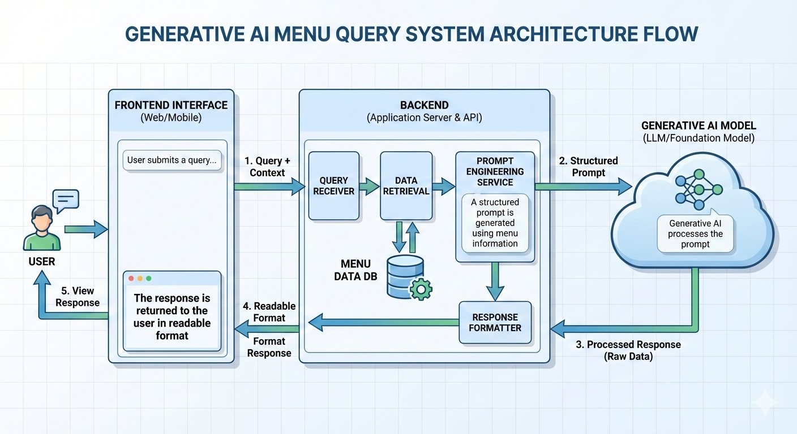

# Project Documentation – Restaurant FAQ System (GenAI)

## 1. Project Overview
The Restaurant FAQ System is a Generative AI-powered application designed to help users make informed dining decisions. It simplifies complex restaurant menus by compressing dish information and answering user queries related to ingredients, dietary preferences, and health considerations.

The project demonstrates the use of Generative AI as an intelligent assistant for real-world decision-making scenarios in the food and hospitality domain.

---

## 2. Objectives
- To reduce customer confusion caused by lengthy restaurant menus
- To provide instant answers to dietary and ingredient-related questions
- To demonstrate the practical use of Generative AI in consumer applications
- To build an efficient FAQ-style dining assistant

---

## 3. Scope of the Project
### In Scope
- Text-based menu processing
- FAQ-style question answering
- Dietary classification (vegan, vegetarian, allergies, gluten-free)
- Menu summarization using Generative AI

### Out of Scope
- Payment or order placement
- Inventory management
- Real-time restaurant database integration

---

## 4. System Architecture

---

## 5. Functional Requirements
- The system shall accept natural language questions from users
- The system shall analyze menu data and dietary attributes
- The system shall generate concise and accurate responses
- The system shall support multiple dietary categories

---

## 6. Non-Functional Requirements
- Fast response time
- Easy-to-use interface
- Scalable architecture
- Secure handling of user inputs

---

## 7. Technologies Used
- Frontend: React.js
- Backend: Python (Flask / FastAPI)
- Generative AI: LLM API
- Data Format: JSON

---

## 8. GenAI Usage Explanation
Generative AI is used to:
- Compress and summarize menu descriptions
- Interpret user intent from natural language queries
- Generate human-like, context-aware responses
- Adapt answers based on dietary constraints

The AI acts as a reasoning engine rather than a static rule-based system.

---

## 9. Limitations
- Responses depend on the accuracy of menu data
- Does not support voice input in the current version
- Requires internet access for AI API calls

---

## 10. Future Enhancements
- Voice-enabled FAQ assistant
- Multi-language support
- Personalized recommendations
- Nutrition and calorie estimation
- Integration with restaurant ordering systems

---

## 11. Conclusion
This project showcases how Generative AI can be applied to improve user experience in everyday decision-making processes. By simplifying menu information and providing instant dietary insights, the system enhances accessibility and usability for restaurant customers.
